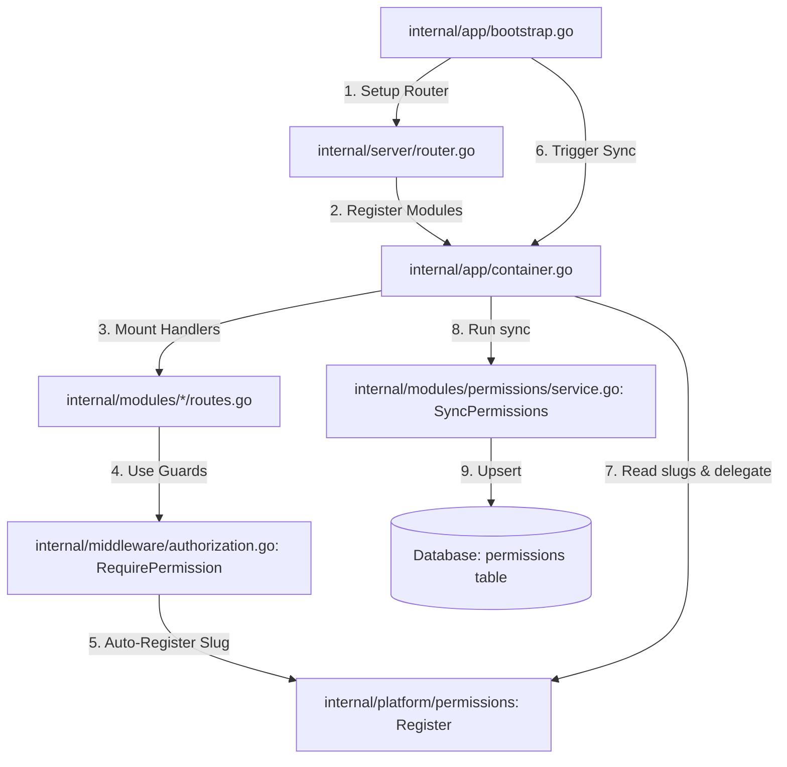

# Design: Permissions Modernization, Global Constants, and CRUD Refactoring

## Technical Approach

We will centralize permission strings using global constants, standardise CRUD naming convention to `list`, implement a self-discovery registry populated during route registration, and sync these discovered permissions to the database on server startup.

The transversal platform package `internal/platform/permissions` holds ONLY global constants and the simple, standard in-memory registry of string slugs. The actual GORM database representation and sync logic remain cleanly in the `permissions` module (`internal/modules/permissions`), keeping the modules completely decoupled and avoiding code duplication.

### Key Components



## Architecture Decisions

| Decision | Alternatives considered | Rationale |
|---|---|---|
| Use `internal/platform/permissions` transversal package | Define constants in `internal/modules/permissions` | Defining them in the module would trigger circular imports since modules (e.g. `users`, `roles`) need permissions constants, and the `permissions` module needs to expose handlers/interfaces. A transversal platform package resolves this. |
| Implement `SyncPermissions` in `permissions.Service` | Implement GORM Upsert in `platform/permissions` | Implementing GORM operations in `platform/permissions` would duplicate GORM mapping models and force platform logic to understand DB structures. Letting the `permissions` module handle sync keeps the business layer clean and respects Single Responsibility. |
| Call `permissions.Register(slug)` inside `RequirePermission` | Read routes reflectively or maintain a static hardcoded array | Reflective route parsing is complex and fragile in Go. Since `RequirePermission(slug)` is called exactly once per route during GIN router initialization at startup, doing registration inside it naturally captures every active permission guard without runtime reflection overhead. |
| Upsert specific fields in `SyncPermissions` | Overwrite entire record | GORM `Updates` allows updating only system fields (`Module`, `Action`, `IsSystem`). This preserves manual changes made to `Name` or `Description` by system administrators. |
| Redefine DTO and Service for `PUT /permissions/:id` | Silent ignore structural updates | Explicitly validating and rejecting modifications to structural fields (`Slug`, `Module`, `Action`) via a clear error prevents frontends/clients from believing they successfully updated structural fields when they were silently ignored. |

## Data Flow

### Server Startup (Bootstrapping & Sync)

```text
app.Bootstrap(ctx)
  ├─ NewRouter(cfg, ..., container.RegisterModules)
  │    ├─ RegisterModules(v1)
  │    │    ├─ users.Register(..., requirePermission)
  │    │    │    └─ requirePermission(permissions.Format(ModuleUsers, ActionList))
  │    │    │         └─ middleware.RequirePermission(slug)
  │    │    │              └─ permissions.Register(slug)  // Registers in in-memory map
  │    │    └─ ... other modules ...
  └─ container.SyncPermissions()
       ├─ slugs := permissions.ListRegistered()
       └─ permissionsService.SyncPermissions(slugs)
            └─ For each registered slug:
                 ├─ Parse module and action
                 ├─ Query existing permission by slug
                 ├─ IF NOT FOUND:
                 │    ├─ PublicID = identity.Generate()
                 │    ├─ Name, Description = humanize(module, action)
                 │    └─ db.Create(...)
                 └─ IF FOUND:
                      └─ db.Model(&existing).Updates(map[string]any{"module": module, "action": action, "is_system": true})
```

### Restricted Update Permission Flow

```text
PUT /api/v1/permissions/:id
  └─ RequirePermission("permissions.manage")
     └─ permissions.Handler.Update
        └─ permissions.Service.Update(id, req)
             ├─ repo.GetByPublicID(id)
             ├─ IF req.Slug != permission.Slug OR req.Module != permission.Module OR req.Action != permission.Action:
             │    └─ return ErrForbidden // Explicitly reject structural changes!
             ├─ permission.Name = req.Name
             ├─ permission.Description = req.Description
             └─ repo.Update(permission)
```

## File Changes

| File | Action | Description |
|---|---|---|
| `internal/platform/permissions/constants.go` | **NEW** | Module and action constants; `Format` formatting helper. |
| `internal/platform/permissions/registry.go` | **NEW** | In-memory registry (`Register`, `ListRegistered`) thread-safe implementation. |
| `internal/middleware/authorization.go` | Modify | Import `platform/permissions` and call `permissions.Register(slug)` in `RequirePermission(slug)`. |
| `internal/app/container.go` | Modify | Expose `SyncPermissions()` method delegating `permissions.ListRegistered()` to the `permissions.Service`. |
| `internal/app/bootstrap.go` | Modify | Call `container.SyncPermissions()` during bootstrapping. |
| `internal/modules/permissions/service.go` | Modify | Implement `SyncPermissions(slugs)`. Reject structural changes in `Update`. Adjust `Create` and `Delete` tests. |
| `internal/modules/permissions/repository.go` | Modify | Add database support for checking and upserting permissions. |
| `internal/modules/permissions/model.go` | Modify | Remove/deprecate `ActionIndex`, replace with `ActionList`. |
| `internal/modules/permissions/dto.go` | Modify | Redefine `UpdatePermissionRequest` validation or field handling to protect structural integrity. |
| `internal/modules/permissions/handler.go` | Modify | Remove `Create` and `Delete` endpoints. |
| `internal/modules/permissions/routes.go` | Modify | Remove `POST` and `DELETE` route registrations. |
| `internal/modules/companies/routes.go` | Modify | Rename `"companies.index"` to `permissions.Format(permissions.ModuleCompanies, permissions.ActionList)`. |
| `internal/modules/roles/routes.go` | Modify | Rename `"roles.index"` to `permissions.Format(permissions.ModuleRoles, permissions.ActionList)`. Use constants for all routes. |
| `internal/modules/users/routes.go` | Modify | Rename `"users.index"` to `permissions.Format(permissions.ModuleUsers, permissions.ActionList)`. Use constants for all routes. |
| `seeds/permissions.go` | Modify | Update to use constants and `permissions.ActionList`. |
| `tests/integration/rbac_test.go` | Modify | Rename `"users.index"` to `"users.list"`. |
| Test files in modules, seeds, and middleware | Modify | Adapt tests to use constants, `"*.list"`, and verify structural update rejection. |

## Interface Contracts

### Platform Permissions Constants

```go
package permissions

const (
	ModuleUsers       = "users"
	ModuleRoles       = "roles"
	ModuleCompanies   = "companies"
	ModuleSettings    = "settings"
	ModuleAuth        = "auth"
	ModulePermissions = "permissions"
)

const (
	ActionList              = "list"
	ActionSelect            = "select"
	ActionView              = "view"
	ActionCreate            = "create"
	ActionUpdate            = "update"
	ActionDelete            = "delete"
	ActionManage            = "manage"
	ActionChangeRole        = "change_role"
	ActionAssignPermissions = "assign_permissions"
)
```

## Error Mapping

| Case | Error |
|---|---|
| `PUT` request alters `Slug` | `403 Forbidden` (or `422 Unprocessable` validation error) |
| `PUT` request alters `Module` | `403 Forbidden` (or `422 Unprocessable` validation error) |
| `PUT` request alters `Action` | `403 Forbidden` (or `422 Unprocessable` validation error) |
| `POST /permissions` | `404 Not Found` (due to route removal) |
| `DELETE /permissions/:id` | `404 Not Found` (due to route removal) |

## Testing Strategy

1. **Unit Tests (Platform permissions)**:
   - Verify `Format` behaves correctly.
   - Verify thread-safe `Register` and `ListRegistered` register and return all unique slugs.

2. **Module Service Tests**:
   - Verify `SyncPermissions` inserts new items with correct humanised names/descriptions, updates structural fields on existing items, and keeps manually changed Name/Description untouched.

3. **Integration Tests (Permissions API)**:
   - Call `PUT /permissions/:id` attempting to change structural fields, asserting it returns 403 / validation error.
   - Call `PUT /permissions/:id` updating only name/description, asserting success (200 OK).
   - Attempt calling `POST /permissions` and `DELETE /permissions/:id`, asserting they return 404.
   - Assert all module route registration test configurations function cleanly.
