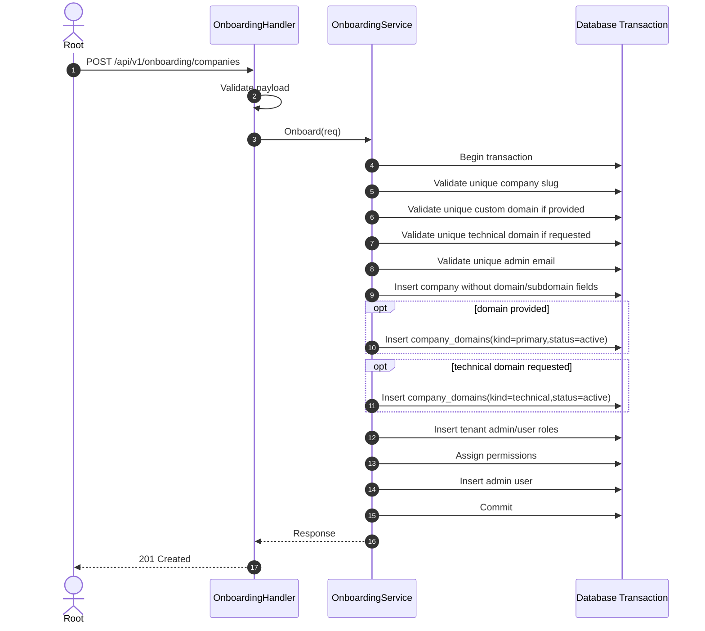
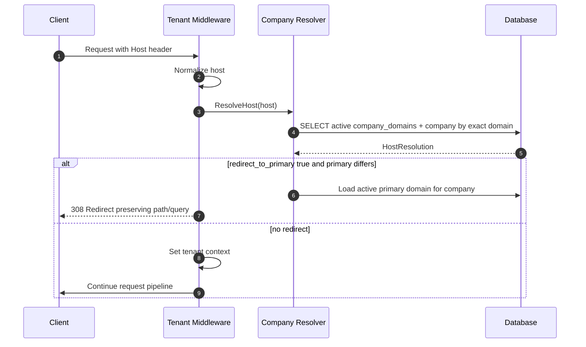
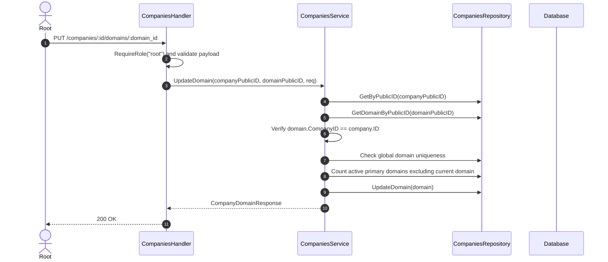

# SDD Design: Company Domains for Multi-Domain Tenants

## Architecture Decisions & Rationale

### 1. `company_domains` as the Only Host Ownership Model

`companies.domain` and `companies.subdomain` create a one-host-per-company design and force tenant middleware to know special string rules. This change introduces `company_domains` as the only host ownership model.

Rationale:

- A tenant can own multiple domains.
- `www`, apex, aliases, and platform technical domains are all explicit rows.
- Tenant resolution becomes an exact database lookup instead of a mix of domain and subdomain heuristics.

### 2. Use `kind` Instead of Exclusive Boolean Flags

Use:

```text
kind VARCHAR NOT NULL
```

Initial values:

- `primary`
- `alias`
- `technical`

Rationale:

- Multiple boolean flags (`is_primary`, `is_alias`, `is_technical`) are mutually exclusive but hard to enforce cleanly.
- `kind` leaves room for future values like `legacy`, `verification`, `reserved`, or `system`.
- `kind = primary` replaces `is_primary` as the semantic source of truth.

### 3. Include Redirect Metadata Now

Use:

```text
redirect_to_primary BOOLEAN NOT NULL DEFAULT false
```

Rationale:

- Redirect behavior is useful for `www → apex`, legacy domains, and canonical SEO behavior.
- Redirecting remains opt-in per domain row.
- Redirects are explicit metadata, not inferred from strings.

### 4. Status-Based Lifecycle, No Soft Delete

Use:

```text
status VARCHAR NOT NULL
```

Initial values:

- `active`
- `inactive`
- `pending_verification`

Rationale:

- Domains should normally be deactivated/reactivated, not soft-deleted.
- Domain ownership remains explicit and auditable without accumulating deleted rows.
- `UNIQUE(domain)` remains simple and blocks accidental cross-company reuse until an explicit transfer/release workflow exists.

### 5. Onboarding Owns Initial Domain Provisioning

The existing onboarding service already runs the company, roles, permissions, and admin creation inside one GORM transaction. Domain row creation should be added inside that same transaction.

Rationale:

- Duplicate domains must rollback the entire tenant bootstrap.
- Root operators keep a simple onboarding payload.
- Company domain rows are born with the company, not patched afterward.

### 6. Tenant Resolution Moves Behind Domain Rows

`companies.Repository.FindByHost(host)` currently queries `companies.domain`. It should query `company_domains` and join/preload the owning company reference.

Rationale:

- Middleware can keep its `CompanyResolver` dependency shape initially.
- Public tenant resolution stops depending on company profile columns.
- Existing container wiring can continue passing the companies repository as resolver if the repository owns the domain lookup.

### 7. Redirect Requires Resolver Metadata

Current `tenant.CompanyRef` contains only company ID and slug. Redirect behavior needs to know whether the matched host should redirect and what the primary domain is.

Recommended approach:

- Add an internal domain-resolution result type in the companies repository/service layer, or extend the resolver contract used by public middleware.
- Keep tenant context assignment separate from redirect decision.

Possible interface:

```go
type HostResolution struct {
    Company tenant.CompanyRef
    MatchedDomain string
    DomainKind string
    RedirectToPrimary bool
    PrimaryDomain *string
}

type CompanyResolver interface {
    FindByPublicIDOrSlug(value string) (tenant.CompanyRef, error)
    ResolveHost(host string) (HostResolution, error)
}
```

Then public middleware can:

1. normalize host;
2. call `ResolveHost(host)`;
3. if `RedirectToPrimary` and `PrimaryDomain != nil` and `PrimaryDomain != host`, return redirect;
4. otherwise set tenant context.

---

## Data Model

### Go Model Sketch

```go
const (
    CompanyDomainStatusActive              = "active"
    CompanyDomainStatusInactive            = "inactive"
    CompanyDomainStatusPendingVerification = "pending_verification"

    CompanyDomainKindPrimary   = "primary"
    CompanyDomainKindAlias     = "alias"
    CompanyDomainKindTechnical = "technical"
)

type Company struct {
    shared.BaseModel
    Name   string `gorm:"type:varchar(150);not null"`
    Slug   string `gorm:"type:varchar(100);uniqueIndex;not null"`
    Status string `gorm:"type:varchar(40);not null;default:'active'"`

    Domains []CompanyDomain `gorm:"foreignKey:CompanyID"`
}

type CompanyDomain struct {
    shared.BaseModel
    CompanyID         uint   `gorm:"not null;index"`
    Company           Company
    Domain            string `gorm:"type:varchar(255);uniqueIndex;not null"`
    Status            string `gorm:"type:varchar(40);not null;default:'active';index"`
    Kind              string `gorm:"type:varchar(40);not null;index"`
    RedirectToPrimary bool   `gorm:"not null;default:false"`
}
```

Notes:

- `shared.BaseModel` already provides `id`, `public_id`, timestamps, and soft-delete behavior if embedded. If soft-delete is inherited, implementation must ensure domain lifecycle still uses `status` semantically and avoid delete flows for domain deactivation.
- If `shared.BaseModel` forces `deleted_at`, the migration can still avoid using it as the uniqueness mechanism for domains.

### Migration Sketch

This project is a starter template that uses Goose with a consolidated initial schema. For this change, update the existing migration file directly:

```text
migrations/20260101000000_init.sql
```

Do not add a new incremental migration file for `change-14-company-domains`.

In the consolidated migration:

```sql
CREATE TABLE company_domains (
    id SERIAL PRIMARY KEY,
    public_id CHAR(26) NOT NULL UNIQUE,
    company_id INTEGER NOT NULL REFERENCES companies(id),
    domain VARCHAR(255) NOT NULL UNIQUE,
    status VARCHAR(40) NOT NULL DEFAULT 'active',
    kind VARCHAR(40) NOT NULL,
    redirect_to_primary BOOLEAN NOT NULL DEFAULT false,
    created_at TIMESTAMPTZ NOT NULL DEFAULT NOW(),
    updated_at TIMESTAMPTZ NOT NULL DEFAULT NOW(),
    deleted_at TIMESTAMPTZ
);

CREATE INDEX idx_company_domains_company_id ON company_domains(company_id);
CREATE INDEX idx_company_domains_status ON company_domains(status);
CREATE INDEX idx_company_domains_kind ON company_domains(kind);
```

Remove from `companies`:

```sql
domain VARCHAR(255)
subdomain VARCHAR(120)
```

Remove indexes:

```sql
idx_companies_domain
idx_companies_subdomain
```

---

## Onboarding Flow

### Request DTO Changes

Current onboarding has `Domain` and `Subdomain`.

Change to:

```go
type OnboardCompanyRequest struct {
    Name                    string  `json:"name"`
    Slug                    string  `json:"slug"`
    Domain                  *string `json:"domain,omitempty"`
    GenerateTechnicalDomain bool    `json:"generate_technical_domain"`
    AdminName               string  `json:"admin_name"`
    AdminEmail              string  `json:"admin_email"`
    AdminPassword           string  `json:"admin_password"`
}
```

`Subdomain` is removed.

### Technical Domain Base Config

Technical domain generation needs a platform base domain, for example:

```text
kilashop.com
```

Recommended config name:

```text
APP_PLATFORM_DOMAIN
```

If `GenerateTechnicalDomain = true` and no platform domain is configured, service should return validation/configuration error before writing.

### Sequence Diagram



---

## Tenant Resolution Flow



---

## Implementation Notes

### Repository

Add queries for:

- find active domain by exact host;
- find active primary domain for a company;
- check domain uniqueness during onboarding;
- create company domain rows inside transaction.

Since onboarding currently uses raw `*gorm.DB`, the first implementation may create `companies.CompanyDomain` directly inside the transaction instead of introducing a separate domain service.

### Middleware

Current public tenant resolution order:

1. exact host via `FindByHost`;
2. first subdomain → `FindByPublicIDOrSlug`;
3. dev-only `X-Tenant`.

Change to:

1. exact active domain via `ResolveHost`;
2. dev-only `X-Tenant` fallback if enabled.

Remove production first-subdomain fallback.

### Redirect Status

Use `308 Permanent Redirect` for method-preserving canonical redirects, unless existing project conventions prefer `301`.

### Cache Behavior

If host resolution is cached by `host:<host>`, redirect/domain status changes may remain cached temporarily. For this change, existing TTL behavior can remain if tests account for deterministic direct repository behavior. Future domain-management endpoints should invalidate host cache on status/redirect updates.

---

## Company Detail Domain Embedding

`GET /api/v1/companies/:id` should return company profile data with its domain collection embedded. This supports root administration screens without requiring a separate detail request followed by `GET /companies/:id/domains` just to inspect the current domain state.

Design constraints:

- Keep `GET /api/v1/companies` lean; do not preload domains for list responses by default.
- Keep company profile update separate from domain lifecycle updates.
- Preserve dedicated domain endpoints for create/update/list operations.
- Preload/order domains only in the detail repository path (`GetByPublicID`).

---

## Root Company Domain Administration

Company-domain administration belongs in the companies module, but it must not overload `PUT /api/v1/companies/:id` because company profile lifecycle and domain lifecycle differ.

### Endpoints

Use the existing companies route convention where `:id` is a company public ID:

```text
GET  /api/v1/companies/:id/domains
POST /api/v1/companies/:id/domains
PUT  /api/v1/companies/:id/domains/:domain_id
```

No DELETE route is registered. Root users deactivate/reactivate a domain by updating `status`.

### DTOs

```go
type CreateCompanyDomainRequest struct {
    Domain            string `json:"domain"`
    Kind              string `json:"kind"`
    Status            string `json:"status"`
    RedirectToPrimary bool   `json:"redirect_to_primary"`
}

type UpdateCompanyDomainRequest struct {
    Domain            string `json:"domain"`
    Kind              string `json:"kind"`
    Status            string `json:"status"`
    RedirectToPrimary bool   `json:"redirect_to_primary"`
}
```

### Business Rules

- Domain values are normalized before persistence.
- `domain` remains globally unique.
- `kind` is restricted to `primary`, `alias`, or `technical`.
- `status` is restricted to `active`, `inactive`, or `pending_verification`.
- A company may have at most one active primary domain.
- `redirect_to_primary = true` is rejected for `kind = primary`.
- Update first loads the company by public ID, then loads the domain by public ID, and rejects the request if the domain belongs to another company.

### Sequence Diagram: Updating a Domain



---

## Test Design

Strict TDD mode is active for apply. Test runner: `go test ./...`.

Recommended RED tests before implementation:

1. Company model/migration no longer exposes `domain`/`subdomain` columns and includes `company_domains`.
2. Onboarding creates primary company domain from `domain` input.
3. Onboarding creates technical domain only when requested.
4. Duplicate domain rolls back onboarding.
5. Tenant middleware resolves by active company domain.
6. Tenant middleware does not resolve implicit `www` without a row.
7. Tenant middleware redirects redirect-enabled alias to active primary domain preserving path/query.
8. Company DTO update rejects/removes direct domain/subdomain fields.
9. Root-only domain admin routes list/create/update domains and expose no delete route.
10. Domain admin service rejects duplicate domains, second active primary domains, primary redirects, invalid kind/status, and cross-company update attempts.

---

## Review Workload Forecast

Likely touched areas:

- migration SQL;
- `internal/modules/companies` model/dto/repository/service tests;
- `internal/modules/onboarding` dto/service/handler tests;
- `internal/middleware/tenant.go` and tests;
- app/container resolver wiring if interface changes;
- OpenSpec canonical specs during archive.

This may approach or exceed 700 changed lines depending on test depth. A chained delivery is likely safer if implementation grows beyond schema + onboarding + resolver basics.
