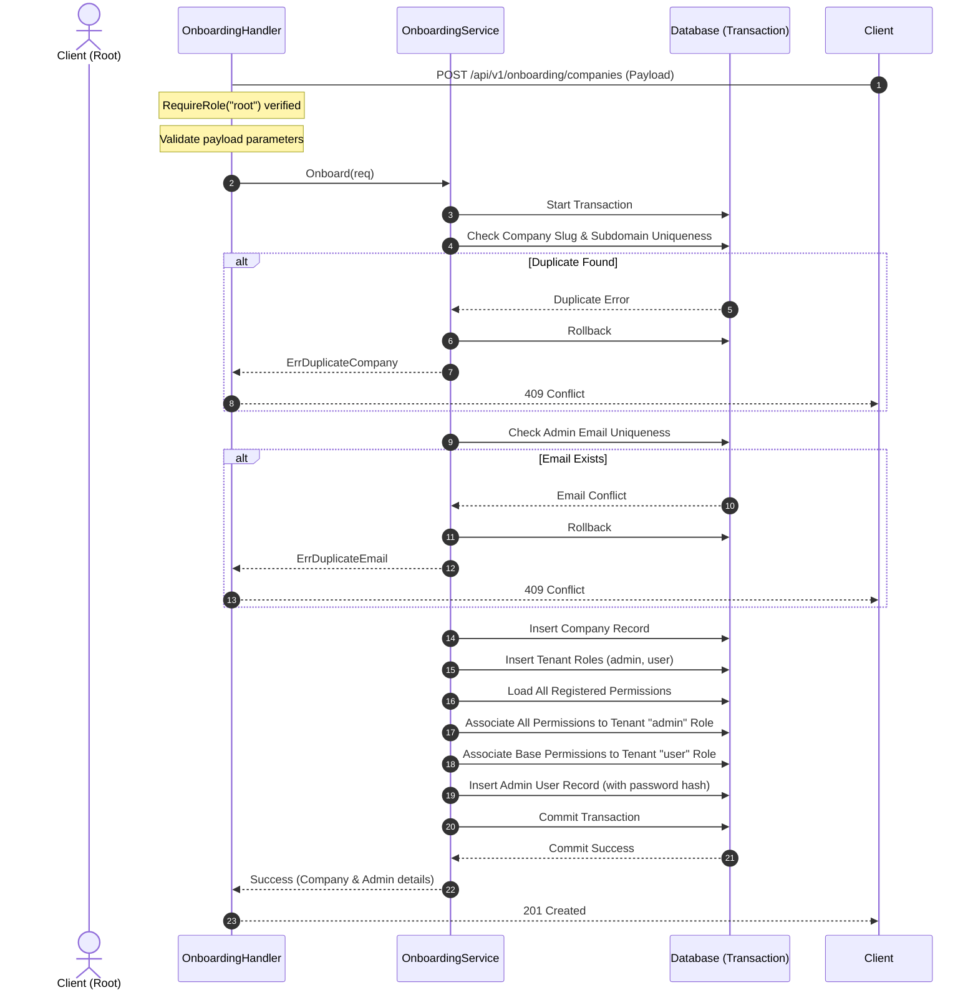

# SDD Design: Company Onboarding, Auto-Admin Sync and Role Protections

## Architecture Decisions & Rationale

### 1. Dedicated Onboarding Module
We will create a separate module under `internal/modules/onboarding`. Rather than adding onboarding to `companies` or `users`, this module acts as a high-level orchestrator that coordinates between `companies`, `roles`, `permissions`, and `users` domains. This maintains strong modular boundaries and high cohesiveness.

### 2. Root-Only Onboarding Protection
Onboarding a company and provisioning its tenant roles/admins is a core system administration concern.
- We will NOT create a custom permission slug (like `companies.onboard`). Creating a permission slug would result in the tenant `admin` role automatically receiving it during startup sync or onboarding since the `admin` receives all registered permissions.
- Instead, the `POST /api/v1/onboarding/companies` route will be protected using the existing **`RequireRole("root")`** middleware. Only system `root` operators can execute this endpoint. This ensures absolute tenant safety and prevents any collision.

### 3. Transaction Wrapping for Onboarding Process
The entire multi-entity onboarding process must run in a single database transaction. We will inject the `*gorm.DB` instance into the `onboarding.Service` to handle the transaction block:
```go
err := s.db.Transaction(func(tx *gorm.DB) error {
    // 1. Create company using tx
    // 2. Create roles using tx
    // 3. Map permissions using tx
    // 4. Create initial admin user using tx
    return nil
})
```
If an error is returned from the callback, GORM automatically triggers a rollback.

### 4. Tenant Admin Access & Automatic Sync
By default, the `admin` role created for a tenant gets mapped to **all** permissions currently loaded in the database. 
To guarantee that administrators automatically receive new system capabilities as the product grows, `SyncPermissions` will automatically assign any newly created system permission to all roles where `slug = 'admin'` at startup:
```sql
INSERT INTO role_permissions (role_id, permission_id)
SELECT id, ? FROM roles WHERE slug = 'admin'
ON CONFLICT DO NOTHING;
```

### 5. Admin Role Protection (No Revocation)
The `admin` role is protected. If anyone tries to modify an `admin` role's permissions via `AssignPermissions`, the service will verify that all currently assigned permissions of the `admin` role are present in the request. If any permission is omitted (revoked), the transaction is aborted and a `403 Forbidden` error is returned.

---

## Sequence Diagram: Onboarding Workflow



---

## Component Designs & Interfaces

### 1. Onboarding Module

#### DTOs (`dto.go`)
```go
package onboarding

import (
	"github.com/enviniom/nexokit/internal/platform/response"
	"github.com/enviniom/nexokit/internal/platform/validator"
)

type OnboardCompanyRequest struct {
	Name          string  `json:"name"`
	Slug          string  `json:"slug"`
	Domain        *string `json:"domain,omitempty"`
	Subdomain     *string `json:"subdomain,omitempty"`
	AdminName     string  `json:"admin_name"`
	AdminEmail    string  `json:"admin_email"`
	AdminPassword string  `json:"admin_password"`
}

type OnboardCompanyResponse struct {
	CompanyPublicID string `json:"company_public_id"`
	CompanySlug     string `json:"company_slug"`
	AdminPublicID   string `json:"admin_public_id"`
	AdminEmail      string `json:"admin_email"`
}

func (r OnboardCompanyRequest) Validate() response.ValidationErrors {
	errs := make(response.ValidationErrors)
	validator.Field(errs, "name", r.Name).Required().Apply(validator.MinLength(2))
	validator.Field(errs, "slug", r.Slug).Required().Apply(validator.MinLength(2))
	validator.Field(errs, "admin_name", r.AdminName).Required().Apply(validator.MinLength(2))
	validator.Field(errs, "admin_email", r.AdminEmail).Required().Apply(validator.Email())
	validator.Field(errs, "admin_password", r.AdminPassword).Required().Apply(validator.MinLength(8))
	return errs
}
```

#### Service (`service.go`)
```go
package onboarding

import (
	"context"
)

type Service interface {
	Onboard(ctx context.Context, req OnboardCompanyRequest) (*OnboardCompanyResponse, error)
}
```

---

### 2. Auto-Sync and Role Protections Extensions

#### `internal/modules/permissions/repository.go`
```go
type Repository interface {
	// ... existing methods
	AutoAssignToAdmins(permissionID uint) error
}

func (r *GormRepository) AutoAssignToAdmins(permissionID uint) error {
	return r.db.Exec(`
		INSERT INTO role_permissions (role_id, permission_id)
		SELECT id, ? FROM roles WHERE slug = 'admin'
		ON CONFLICT DO NOTHING
	`, permissionID).Error
}
```

#### `internal/modules/roles/service.go`
```go
func (s *roleService) AssignPermissions(tc tenant.TenantContext, publicID string, req AssignRolePermissionsRequest, actorPermissions []string) (*RolePermissionAssignmentResponse, error) {
	// ... validations and loading role ...
	
	if role.Slug == roles.AdminRoleSlug {
		for _, perm := range role.Permissions {
			if !selected[perm.Slug] {
				return nil, apperror.ErrForbidden // Revoking admin permissions is strictly forbidden
			}
		}
	}
	
	// ... save and commit replacement ...
}
```
